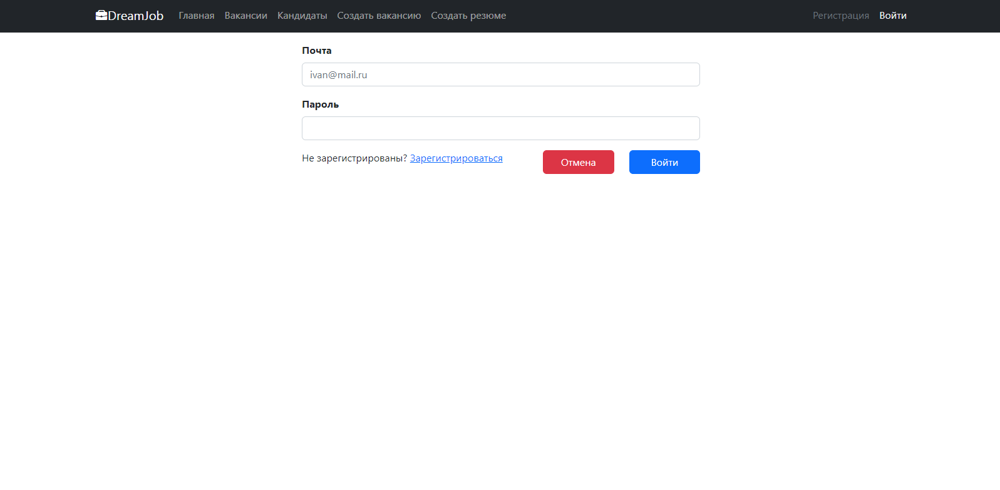
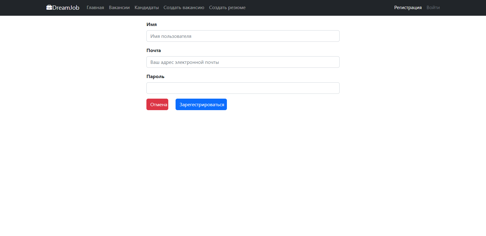
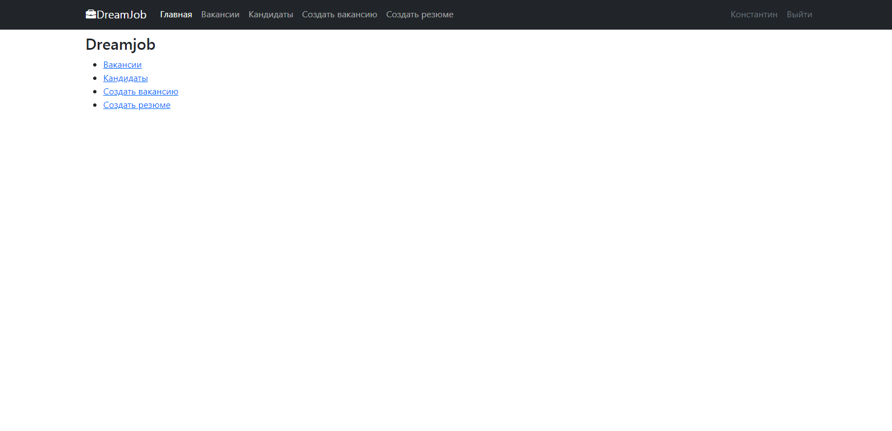
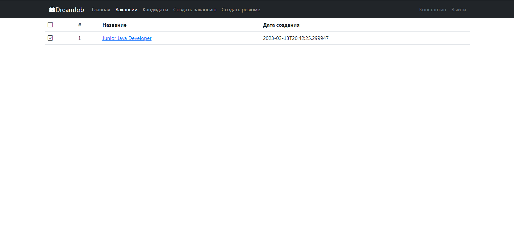
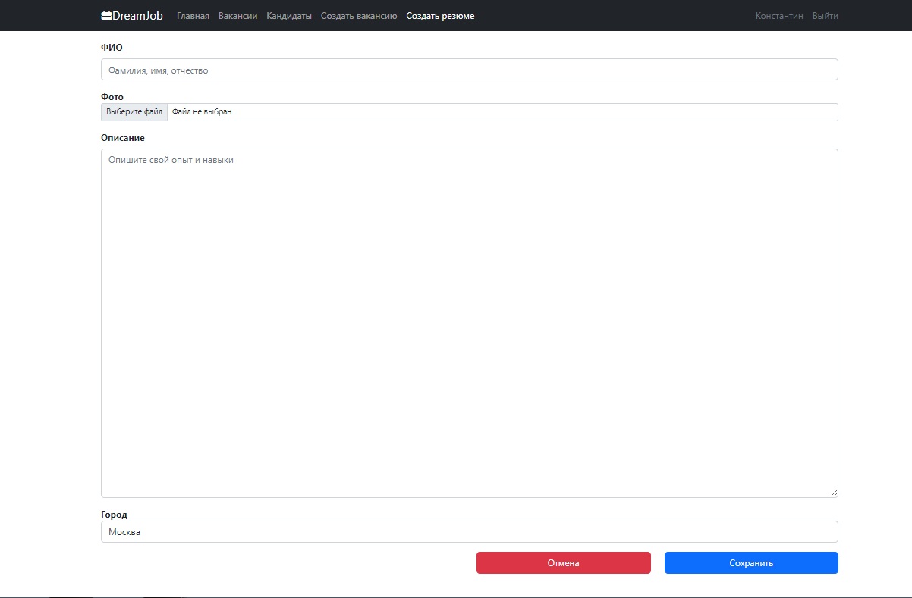
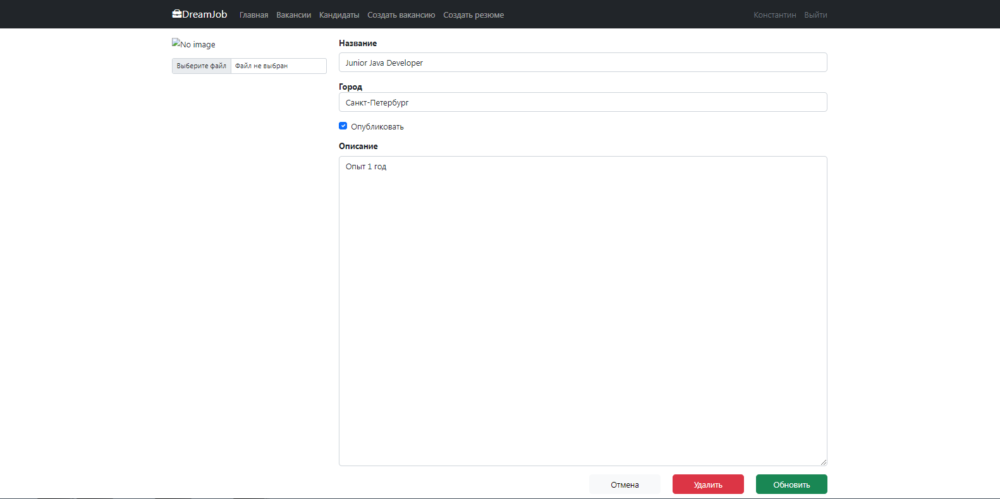

## Приложение "Работа мечты".

### Описание проекта:

В системе будут две модели: вакансии и кандидаты. Кандидаты будут публиковать резюме. Кадровики будут публиковать вакансии о работе.

Кандидаты могут откликнуться на вакансию. Кадровик может пригласить на вакансию кандидата.

## Стек технологий:
- Java 17
- Spring Boot
- Thymeleaf
- Liquibase
- Maven 3.1.2.
- Sql2o version 1.6.0
- PostgreSQL 10
- H2
- jcip
- mockito

## Требования к окружению:
- Java 17
- Maven версия не ниже 3.1.2
- PostgreSQL версия не ниже 10.

## Взаимодействие с приложением:
**Страница входа.**

**Страница регистрации.**

**Главная страница.**

**Список всех вакансий/кандидатов.**

**Создать новое резюме/вакансию.**

**Внутри конкретной вакансии/резюме.**
андидата.